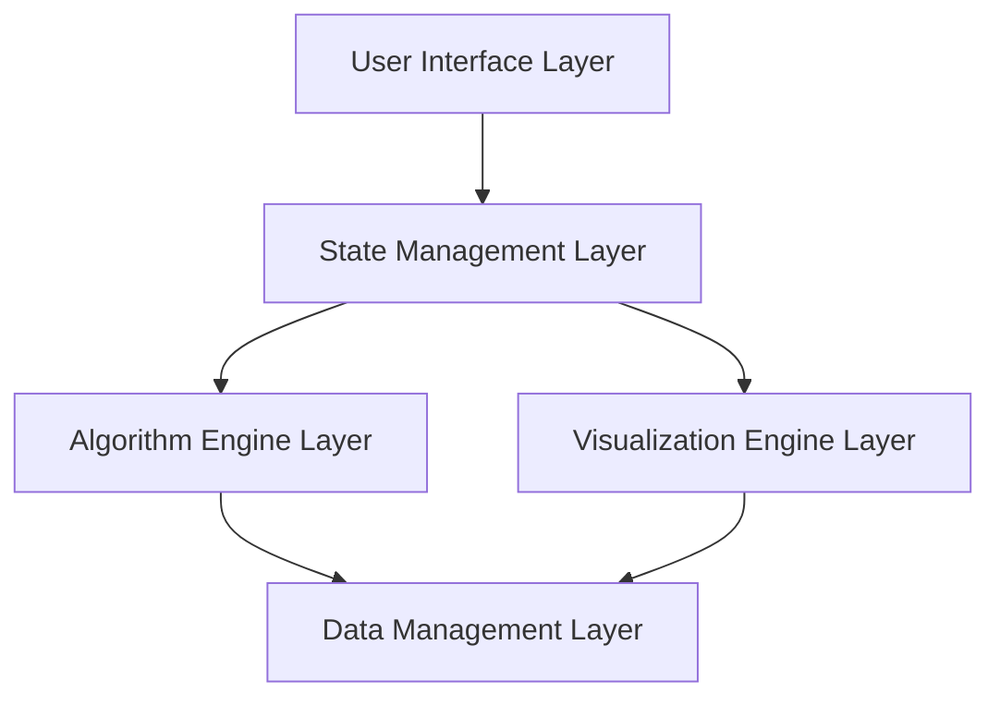

# Design Document

## Overview

The Algorithm Visualizer is a React-based web application that provides interactive visualization of algorithms through a modular, component-driven architecture. The system uses a state management approach to handle algorithm execution, visualization rendering, and user interactions. The design emphasizes performance, extensibility, and educational value.

## Architecture

The application follows a layered architecture with clear separation of concerns:



### Core Architecture Principles

- **Component-based UI**: React components for modular, reusable interface elements
- **Centralized State**: Redux/Context API for predictable state management
- **Algorithm Abstraction**: Generic algorithm interface for consistent execution
- **Visualization Engine**: Canvas-based rendering for smooth animations
- **Plugin Architecture**: Extensible system for adding new algorithms

## Components and Interfaces

### UI Components

#### AlgorithmSelector
- Dropdown component for algorithm selection
- Displays algorithm metadata (name, complexity, description)
- Triggers algorithm loading and initialization

#### VisualizationCanvas
- Canvas-based component for rendering algorithm steps
- Handles bar charts, array representations, and highlighting
- Manages animation timing and visual transitions

#### ControlPanel
- Play/pause/reset/step controls
- Speed adjustment slider
- Progress indicators and step counters

#### DataInput
- Text input for comma-separated values
- Random data generation controls
- Data validation and error display

#### CodeEditor (Custom Algorithm Mode)
- Monaco Editor integration for code editing
- Syntax highlighting and error detection
- Code compilation and validation

#### ComparisonView
- Split-screen layout for algorithm comparison
- Synchronized execution controls
- Performance metrics display

#### AlgorithmInfo
- Pseudocode display with step highlighting
- Complexity analysis and educational content
- Algorithm description and use cases

### Core Interfaces

#### Algorithm Interface
```typescript
interface Algorithm {
  name: string;
  description: string;
  complexity: {
    time: { best: string; average: string; worst: string };
    space: string;
  };
  execute(data: number[]): AlgorithmStep[];
  validate(data: number[]): ValidationResult;
}
```

#### AlgorithmStep Interface
```typescript
interface AlgorithmStep {
  id: number;
  description: string;
  data: number[];
  comparisons: number[];
  swaps: number[];
  highlights: number[];
  pseudocodeLine: number;
  metrics: StepMetrics;
}
```

#### Visualization State
```typescript
interface VisualizationState {
  currentStep: number;
  totalSteps: number;
  isPlaying: boolean;
  speed: number;
  data: number[];
  algorithm: Algorithm | null;
  steps: AlgorithmStep[];
}
```

## Data Models

### Algorithm Registry
- Centralized registry of available algorithms
- Metadata storage for algorithm information
- Dynamic loading and registration system

### Execution Context
- Current algorithm state and progress
- Step history for backward navigation
- Performance metrics and timing data

### User Preferences
- Saved custom algorithms
- Preferred visualization settings
- Input data presets

### Comparison Session
- Dual algorithm execution state
- Synchronized timing controls
- Comparative performance data

## Error Handling

### Input Validation
- Data format validation with clear error messages
- Range and size limit enforcement
- Real-time validation feedback

### Algorithm Execution
- Runtime error catching and user-friendly display
- Graceful handling of infinite loops or excessive operations
- Step limit enforcement for performance protection

### Custom Code Validation
- Syntax error detection and highlighting
- Runtime error isolation and reporting
- Security validation for user-provided code

### Performance Safeguards
- Maximum data size limits
- Execution timeout protection
- Memory usage monitoring

## Testing Strategy

### Unit Testing
- Algorithm implementation correctness
- Component rendering and interaction
- State management logic
- Utility function validation

### Integration Testing
- Algorithm execution flow
- Visualization rendering pipeline
- User interaction workflows
- Data persistence and retrieval

### Performance Testing
- Large dataset handling
- Animation smoothness
- Memory usage optimization
- Execution speed benchmarks

### User Experience Testing
- Educational effectiveness
- Interface usability
- Error message clarity
- Cross-browser compatibility

### Algorithm Validation Testing
- Correctness verification against known outputs
- Edge case handling
- Performance characteristic validation
- Step-by-step execution accuracy